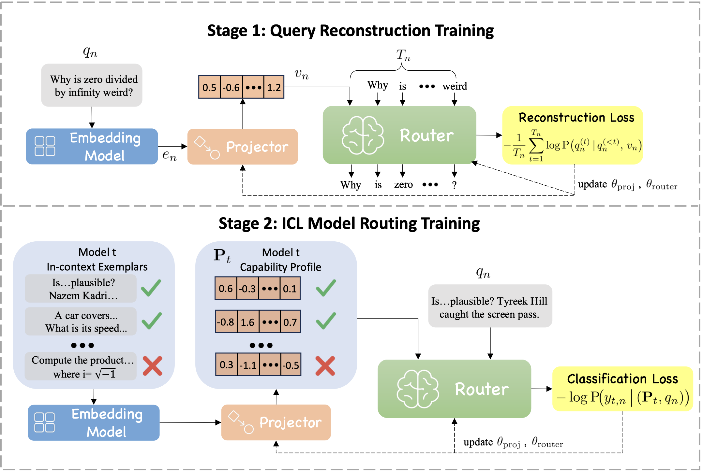

# ICL-Router: In-Context Learned Model Representations for LLM Routing

This repository contains the code and dataset for the  paper:

**"ICL-Router: In-Context Learned Model Representations for LLM Routing"**



## Data

You can download the dateset from https://huggingface.co/datasets/lalalamdbf/ICL-Router. Please put it in ./data. Below, we provide a brief description of each file:

- *question_train.json* and *question_test.json*: These files contain the training and test sets, respectively, used for **Query Reconstruction Training**.
- *train_router.json* and *test_router.json*: These files contain the training and test sets, respectively, used for **ICL Model Routing Training**.
- *expert100.json*, *expert300.json*, *expert500.json*  and *expert1000.json*: These files record the performance of each candidate LLM on a representative set of queries, indicating whether each response is correct. The numbers (100, 300, etc.) denote the number of questions included in each evaluation set. Each set is constructed by selecting queries that were correctly answered by only a subset of models (from a pool of eight), ensuring a challenging and discriminative evaluation. Queries that all models answered correctly or incorrectly are excluded, as they provide limited insight into model capability. All evaluation sets are drawn from the same in-domain benchmarks used by baseline methods, without introducing any additional data.

## Installation

Ensure you have all dependencies installed by running:

```bash
pip install -r requirements.txt
```

### Challenging Query Set Construction

```
sh ./scripts/generate_experts_information.sh
```

### Query Reconstruction Training

```bash
# Multi-GPU: 8-GPU Training
sh ./scripts/train_stage1.sh 0,1,2,3,4,5,6,7,8 
```

### ICL Model Routing Training

```bash
# Multi-GPU: 8-GPU Training
sh ./scripts/train_stage2.sh 0,1,2,3,4,5,6,7,8 
```

We have already integrated the evaluation code into the training file. In the future, we will also reorganize the code and provide a separate evaluation file.

## Bibliography

Thanks for your reading. If you find this repo useful, please cite our paper.

```
@misc{wang2025iclrouterincontextlearnedmodel,
      title={ICL-Router: In-Context Learned Model Representations for LLM Routing}, 
      author={Chenxu Wang and Hao Li and Yiqun Zhang and Linyao Chen and Jianhao Chen and Ping Jian and Peng Ye and Qiaosheng Zhang and Shuyue Hu},
      year={2025},
      eprint={2510.09719},
      archivePrefix={arXiv},
      primaryClass={cs.LG},
      url={https://arxiv.org/abs/2510.09719}, 
}
```